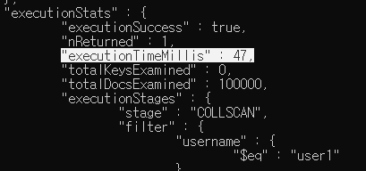
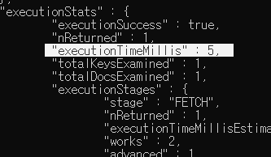

## MongoDB

shard : 데이터 분할 저장.

replica : 자기와 똑같은 서버를 복제한다. 


단점 : 데이터 소실될 수 있음.  개인정보, 배송상태 등 . 그러므로 일반기업에서 쓰는 형식을 사용할 수 없다. 


대부분의 NoSQL 은 key/value 개념 지원 


-Redis ( 컴퓨터 끄고 나면 데이터 다 사라짐. )

언제쓰나? 예: 야놀자. 실제 숙박업소. 구매를 하게 되면 야놀자 -> 진짜 숙박업소로 결제 내역이 보내져야 한다. 이러한 실시간 정보 전달을 잃지 않으려고.,


장점 : 유연한 데이터 모델

-  비정형 데이터 구조
- 정해진 스키마를 사용 x


### Mongo DB

● 10gen 사에서 개발한 제품 (개발언어 C++) 

● 스키마를 고정하지 않으므로 다양한 형태의 데이터 저장 가능 

● JSON 형태의 데이터 사용 

●  **Join이 불가능**하기 때문에 Join이 필요없도록 데이터를 설계해야 됨

 ● 메모리에 의존적이라서 메모리의 크기로 성능이 좌우 

● 주로 데이터를 저장하여 조회만 하고 삭제나 수정이 없는 업무에 적합 

● 관계나 트랜잭션이 중요한 금융 / 결제 / 게시판 등의 서비스에는 부적합


mongoDB - 27017


find() : 여러개 조회

findone : 한개 조회 


a가 15보다 큰


a가 2보다 크고 4 이하인 것. 


###  ※ 비교 연산자 $gt → >, $lt → <, $gte → >=, $lte → <=, $ne → !=


OR 사용. 


in 사용 


### 보고자하는 데이터만 추출함. id는 0(안보여주고) a는 1 (보여줘라.)


■ MongoDB CRUD – 연습문제 

● prod collection 사용

 ● 100개의 제품 정보를 document에 저장 - for 반복문 사용 - 제품정보 필드 : name / price / count ㆍname : name-1 ~ name-100 ㆍprice : 1001 ~ 1100 ㆍcount : 10 ~ 1000 ex) {name : 'name-1', price : 1001, count : 10}, …, …, {name : 'name-100', price : 1100, count : 1000} 

● price가 1010원 보다 크거나 같고 1020원 보다 적거나 같은 제품 또는 price가 1070원 보다 크고 1100원 보다 적은 제품 조회

```shell
use test

for(var i =1; i<=100; i++) {

db.prod.save({

​			name : 'name-'+i,

​			price : 1000 + i,

​			count : i * 10

})

}
```


``` shell
db.prod.find({$or:[{price : {$gte: 1010, $lte: 1020}},
	{price : {$gte: 1010, $lte: 1020}} ]})


```

-------------

## Index 활용

10만개 document 생성

```shell
for (var i = 0; i < 100000; i++) {
 db.users.save(
 {
 i : i,
 username : 'user' + i,
 age : Math.floor(Math.random() * 100),
 created : new Date()
 }
 )
}
```

```shell
# index적용 전 

db.users.find( { username : 'user1' } ).explain('executionStats')
```



```shell
#인덱스 적용
db.users.ensureIndex( { username : 1 } )
```



확연히 시간이 줄어들었다. 