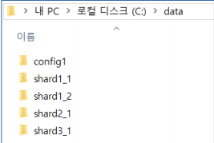

## ReplicaSet

정보를 여러 군데 분산 저장하는 것 

정보를 안전하게 보관하려고 사용함.

한개의 Primary 와 두개의 Secondary 로 구성


### 구성하기

1. C:/ data 폴더에 각 primary, secondary1, secondary2 폴더를 만든다.

2. pri,sec1,sec2 에 맞는 각 cmd 창을 띄운다(3개)

3. 각 cmd 에 서버를 실행한다.

   ``` shell
   mongod --dbpath c:/data/secondary1 --port 20000 --replSet replica_test
   ```

   20000 = primary

   20001 = secondary1

   20002 = secondary2

4. 새로운 cmd 창을 띄워서 primary 서버에 접속한다.

   ```shell
   mongo localhost:20000/admin 
   ```

5. primary 서버에 접속한 후 ReplicaSet 환경설정

   primary , seocondary1, secondary2 를 같은 ReplicaSet 으로 만들어버림. 

```sehll
var config = {
 _id:'replica_test', members: [
 {_id:0, host:'localhost:20000'},
 {_id:1, host:'localhost:20001'},
 {_id:2, host:'localhost:20002'}
 ]
};
```

6. 바로 앞에 ReplicaSet 환경설정 했던 것을 초기화 (환경설정 값으로 변경)함.

``` shell
rs.initiate(config)
```

7.  Primary 서버에서(해당 cmd 창에서) 데이터 입력 

   ```shell
   use log
   for(var i = 0; i < 100; i++) {
    db.connect.save( { ip : "test" + i } )
   }
   ```

   ```shell
   use log
   db.connect.count() # 100이 나온다는 것을 알 수 있다. 
   ```

8.  Secondary1 서버 접속 후 (port 20001인 cmd창) 복제된 데이터 확인

   ``` shell
   use log
   rs.slaveOk()
   db.connect.count()
   ```

   secondary2에도 들어가서 다음과 같이 입력하면 똑같이 100 이 나온다는 것을 알 수 있다.

9. primary 서버창에서 (20000 cmd창) secondary1 , secondary2 모두를 삭제하고

   ``` shell
   rs.remove('localhost:20001')
   
   #혹은
   
   rs.remove('localhost:20002')
   ```

primary 에 더 하나의 데이터를 save 하면 총 count 가 101 이 된다.

10. 끊긴 상태에서는 secondary 1 , secondary 2 모두 아직도 100으로 남아있다.

11. 다시 한 번, Primary 서버 접속 후 secondary1과 secondary2 를  연결함.

    ```shell
    
     rs.add('localhost:20001')
     
     rs.add('localhost:20002') 
     
    ```

    각 secondary 에서 count 를 확인하면 101 이 됨을 알 수 있다.

    

### shard


대용량 데이터 저장을 위해 데이터를 분산 저장하는 기능 

응용 중계 데이터 3계층 구조 . 

데이터 3계층 : primary ,secondary1, seondary2 같은 것들

중계:   ~~(은행원,  ATM 기들)~~  mongos, config 서버를 사용함. 

응용 : 실제 사용자 client (고객)


## shard 구성하기

config server 필요함.

config server 는 shards 를 mongos 에 알려주는? 보조역할을 한다. 

다음과 같은 shard를 구성해 보자. 

- 데이터 서버 1 (레플리카셋 구성) 

- 데이터 서버 2 

- 데이터 서버 3 
-  중계 서버 1

1.  mongo 데이터 저장 서버 및 config 디렉토리 생성

   


명령 프롬프트 6개 (서버용들)( 샤드1_1/샤드1_2/샤드2/샤드3/config/mongos) + 

명령 프롬프트 2개 (mongos client/ 범 client )


 데이터 서버 1 구동

```python
mongod --shardsvr --dbpath c:\data\shard1_1 --port 40001 --replSet firstset mongod --shardsvr --dbpath c:\data\shard1_2 --port 40002 --replSet firstset
```

● 레플리카셋 환경설정 ( mongo localhost:40001/admin )

```python
var config = {
 'replSetInitiate' : {
 _id : 'firstset',
 'members' : [
 { _id : 1, host : 'localhost:40001' },
 { _id : 2, host : 'localhost:40002' }
 ]
 }
}
db.runCommand( config )
```

● 데이터 서버 2 구동

` mongod --shardsvr --dbpath c:\data\shard2_1 --port 40004 --replSet secondset`

● 레플리카셋 환경설정 ( mongo localhost:40004/admin )

```python 
var config = {
 'replSetInitiate' : {
 _id : 'secondset',
 'members' : [
 { _id : 1, host : 'localhost:40004' }
 ]
 }
}
db.runCommand( config )
```


**\- 구성된 서버가 1대만 있더라도 레플리카셋 환경설정 필요**


그다음 config 서버 구동, 레플리카셋 환경설정

mongos 서버 구동, 레플리카셋 환경설정


mongos 서버에 십만개 데이터 만들기

```python
use person
for(var i = 0; i < 100000; i++) {
 db.user.save( { name : "test" + i } )
}
```


결론 : 

mongos 에 만든 십만개의 데이터가 

shard 1,2,3 에 똑같이  쪼개어져서 들어가게 된다.

그리고 shard1-1과 1-2 에는 똑같은 데이터 약 3만 4000개가 들어감을 알 수 있다.

